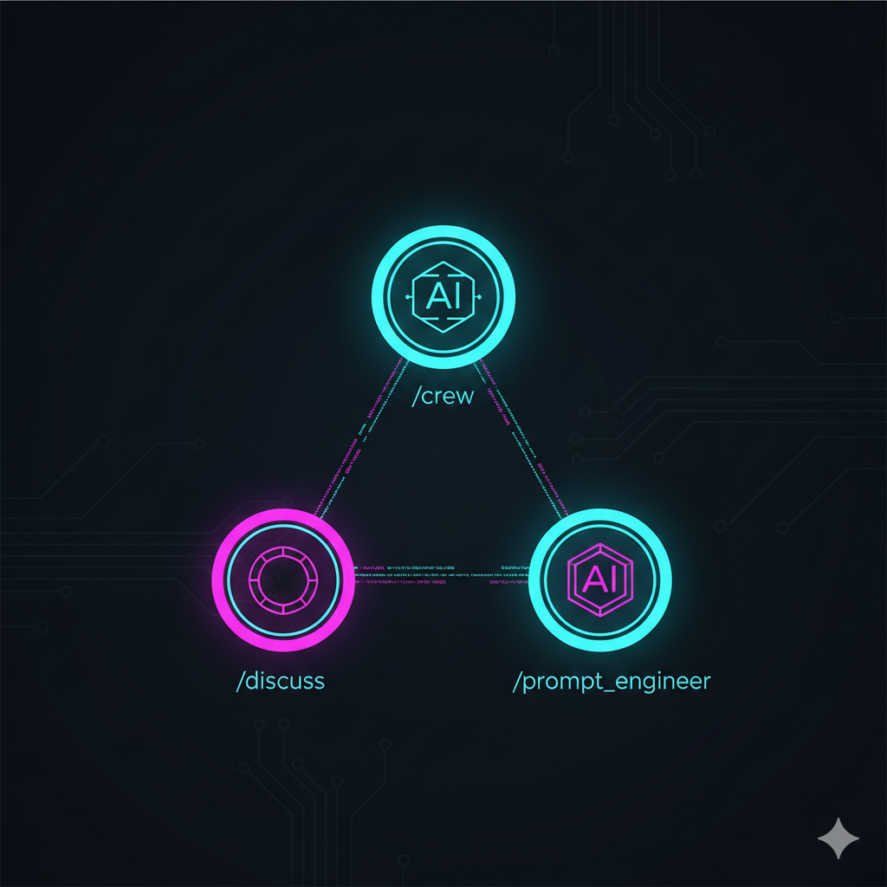

<p align="center">
  
</p>

# Cursor AI Agent Team Framework

**A methodology for human-AI collaboration, implemented as a Cursor framework.** Intelligence augmentation — an elite team under your command, with zero handoff and inherent context continuity.

cursor-agent-team is first a **methodology and a philosophy** of how humans and AI should work together—then a framework that implements it. How we think about AI shapes how we build with it.

## Why cursor-agent-team?

We augment human capability; we don't replace it. Three design pillars:

1. **Multi-role, not multi-agent** — One LLM, one conversation. `/discuss` and `/crew` share the same context. No agent handoff, no context loss. Like a meeting room where everyone has perfect memory.

2. **Human-in-the-loop by design** — You are the conductor. We explore, you decide. We execute, you confirm. "Your command, our execution" — not "set and forget."

3. **Empowerment, not replacement** — Democratizing team access: individuals get team-level capability. Cognitive load redistribution: you think strategy, we handle execution details. Frees you from the "details quagmire" for purer thinking.

**We believe**: AI should augment human judgment, not replace it. Context continuity matters more than agent count. Plans grounded in fresh research beat plans from training data alone. And the human must remain in the loop—as conductor, not spectator.

**Core value (formal)**: Intelligence Augmentation (IA); Democratization of expertise / Capability expansion; Cognitive load redistribution; Human-in-the-loop (HITL); Human-AI Teaming — human as conductor.

**Core innovation**: Multi-role, single-conversation architecture. Zero handoff → inherent context continuity. Multi-agent systems face context loss at handoff; we avoid it by design. No AI-AI coordination; human orchestrates.

**Design philosophy**: (1) Intelligence Augmentation — augment, not replace. (2) Human-in-the-loop by design; not set-and-forget. (3) Multi-role, not multi-agent — role as "mask," single conversation. (4) Human-AI teaming — human as conductor.

**Design principles**: Zero handoff; Plan-and-Execute (planning-execution separation); Constrained generation / specification-driven; Exploration vs exploitation (by role); Retrieval-augmented planning (knowledge cutoff mitigation); Dedicated agent workspace (scratchpad, external memory, staged generation); Common Ground / Mental Model Alignment (persona); Persona Sandboxing.

## What it is

A **multi-role collaboration framework** for Cursor IDE and Qwen Code. One LLM wears different "masks" (commands) in the same conversation. Provides:

- **Structured workflow**: discuss → plan → execute
- **Specialized roles**: Each command has distinct responsibilities
- **Hard constraint validation**: Python scripts ensure deterministic output
- **Extensible team**: Create new roles via `/prompt_engineer`

## Positioning & Related Concepts

| Concept | Our approach |
|---------|--------------|
| **Intelligence Augmentation (IA)** | We augment human cognitive capability rather than replace it (Licklider's man-computer symbiosis; Springer 2024) |
| **Multi-role vs multi-agent** | Multi-agent systems use handoffs; context loss is a critical challenge. We avoid it by design: zero handoff, one conversation |
| **Human-AI teaming** | Human as conductor; AI roles are "masks" in the same meeting (National Academies 2022) |
| **Cognitive load redistribution** | You focus on strategy; we handle execution details (Cognitive Load Theory) |

| vs | cursor-agent-team |
|----|-------------------|
| Multi-agent frameworks | No handoff, no context loss |
| Autonomous agents | Human-in-the-loop, not set-and-forget |
| Generic AI assistants | Structured roles, workflow enforcement, team metaphor |

## Quick Start

Tell Cursor Agent:

```
Install cursor-agent-team from https://github.com/thiswind/cursor-agent-team.git as a submodule and run the install script.
```

Then type `/discuss` to start.

For manual installation or Qwen Code, see [Installation](#installation).

## Core Roles

| Role | Command | Description |
|------|---------|-------------|
| **Discussion Partner** | `/discuss` | Exploration mode — breadth and depth, no execution. Research-first planning: automatically searches for latest academic and industry research before synthesizing plans (Retrieval-augmented planning; knowledge cutoff mitigation). |
| **Crew Member** | `/crew` | Execution mode — strict adherence to plan as specification. Plan-and-Execute architecture; constrained generation. Exploitation mode. |
| **Prompt Engineer** | `/prompt_engineer` | Creates and maintains new roles (commands) |

**Research-first planning** — Plans should not come from LLM training data alone. Training data has a knowledge cutoff; plans synthesized from it can be outdated or wrong. We design `/discuss` to search for latest academic and industry research *before* synthesizing plans (retrieval-augmented planning). Fresh context, then synthesis—a methodological stance, not just a feature.

## Workflow


```
/discuss → [Explore & Plan] → /crew → [Execute] → Done
                ↓
         /prompt_engineer → [Create New Role] → Use New Command
```

1. **Plan**: Use `/discuss` to explore ideas and generate execution plans
2. **Execute**: Use `/crew` to execute the plans
3. **Expand**: Use `/prompt_engineer` to create new roles when needed

## Installation

**Cursor IDE** — Tell Cursor Agent to install, or run manually:

```bash
git submodule add -f https://github.com/thiswind/cursor-agent-team.git cursor-agent-team
./cursor-agent-team/install.sh
```

Update: `git submodule update --remote cursor-agent-team && ./cursor-agent-team/install.sh`

**Qwen Code**:

```bash
git submodule add -f https://github.com/thiswind/cursor-agent-team.git cursor-agent-team
./cursor-agent-team/install_qwen.sh
```

Update: `git submodule update --remote cursor-agent-team && ./cursor-agent-team/install_qwen.sh`

**Note**: The workspace at `cursor-agent-team/ai_workspace/` is shared between both platforms.

## Features

### Core

**Agent Workspace** — Dedicated persistent workspace for agents. Agents can write scripts, take notes, save intermediate results from searches and research. Aligns with scratchpad reasoning and external memory research; enables staged refinement for higher output quality than direct generation. See `ai_workspace/README.md`.

**Persona System (v0.8.0+)** — Script-driven persona integration without degrading work quality. Based on [persona-spec](https://github.com/thiswind/persona-spec).

Communication requires synchronization of mental models. Persona provides warmth and rapport that increase human affinity and trust, improving coordination efficiency between human leaders and AI teams—not for companionship, but for more effective human-machine collaboration.

```bash
python cursor-agent-team/_scripts/persona_output.py --check
```

**Inspiration Capital (v0.7.0+)** — Scatter card collection for sparking creativity.

```bash
python ai_workspace/inspiration_capital/scripts/create_card.py --source "Source" --trigger "Trigger"
python ai_workspace/inspiration_capital/scripts/draw_cards.py --count 3
```

See `ai_workspace/inspiration_capital/README.md` for details.

### Extended

- **Text-to-Speech (macOS)**: Voice feedback via `say`; activated when user requests ("read to me"). `python cursor-agent-team/_scripts/tts_speak.py --check`
- **Social Media**: Integration with [Moltbook](https://moltbook.com/). See `.cursor/rules/social_media_policy.mdc`
- **Spec-Kit Translator**: Converts plans to [spec-kit](https://github.com/github/spec-kit) format. `/spec_translator PLAN-B-001`

## Technical Architecture

Hybrid architecture: LLM soft constraints (prompt rules) + script hard constraints (Python). Critical operations use deterministic scripts to validate outputs before committing.

```
┌─────────────────────────────────────────────────┐
│                    LLM Layer                     │
│   (Soft Constraints: Prompt rules)              │
└────────────────────┬────────────────────────────┘
                     │ Calls
                     ▼
┌─────────────────────────────────────────────────┐
│                  Script Layer                    │
│   (Hard Constraints: Python scripts)             │
│   - validate_topic_tree.py  - preflight_check.py │
│   - cleanup_ai_workspace.py                     │
└─────────────────────────────────────────────────┘
```

**Architecture highlights**: Multi-role + single conversation; Plan-and-Execute; Dedicated agent workspace (context engineering, cognitive artifacts); Hybrid constraints (soft + hard); Phase markers (workflow verification); Command-as-role.

## Why This Architecture

We are not behind the Skills wave—we are ahead of it. Our design addresses problems that traditional rules-based and skill-based architectures cannot solve.

### Orchestration vs Capability

| Approach | Focus | What it solves |
|----------|-------|----------------|
| **Rules** | Passive constraints by scope | Code style, conventions—but cannot role-switch or orchestrate workflow |
| **Skills** | Capability modules (add-and-use) | Extend what the agent can do—but no workflow model, no join points |
| **Ours** | Orchestration-first, methodology-first | *How* humans and AI collaborate—workflow, role switching, spec-driven execution |

We define collaboration workflow; we don't just add capabilities. Command + Rules + Scripts work together: Command defines phases (join points), Rules define aspects, Scripts provide deterministic validation.

### Aspect-Oriented Design

Cross-cutting concerns (Gleaning, Wandering, Persona Output, TTS) are woven into the workflow at defined join points—not embedded in core logic. Commands define Phase/Step as join points; Rules define aspects that invoke scripts at those points. Traditional Skill architectures have no workflow model or join points; they cannot achieve this weaving.

### Spec-Script Integration

Specification (Command + mdc) drives *when* and *why* to call; scripts execute *how* with deterministic validation. This aligns with "Blueprint First, Model Second" (workflow logic in spec, LLM for bounded tasks) and Formal-LLM (hard constraints via script validation). The spec-script loop—LLM reads spec, runs script, script validates—runs in a single conversation.

### Why Cursor

Cursor provides Commands (workflow definition), Rules (aspect definition), and Agent (script execution) in one session. This tight integration enables spec-driven execution and AOP-style weaving. Cursor is currently the best platform to implement our methodology.

See `cursor-agent-team/_scripts/README.md` for script details.

## Version

Current version: **v0.10.9**. See [CHANGELOG.md](CHANGELOG.md).

## License

GNU General Public License v3.0 (GPL-3.0). See [LICENSE](LICENSE).

## Author

**thiswind** — [@thiswind](https://github.com/thiswind)
